* Table of Contents 
{:toc}

--------------------------------------------------------------------------------------------------------------------

## **Setting up, getting started**

Please refer to the guide [_Setting up and getting started_](SettingUp.md).

--------------------------------------------------------------------------------------------------------------------

## **Design**

### Architecture

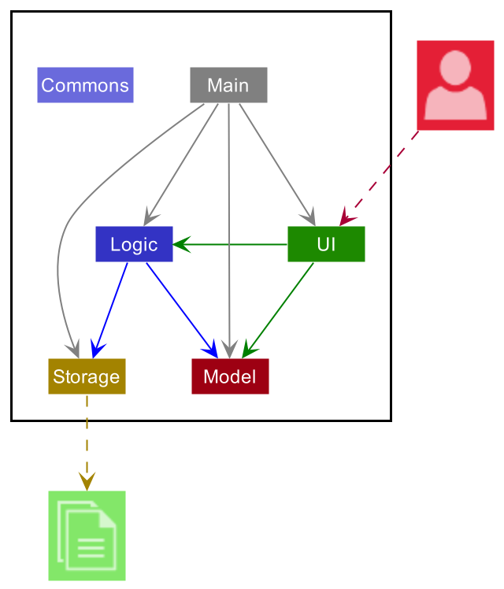

The ***Architecture Diagram*** given above explains the high-level design of the App. Given below is a quick overview of
each component.

:bulb: **Tip:** The `.puml` files used to create diagrams in this document can be found in
the [diagrams](https://github.com/AY2021S2-CS2103T-W10-2/tp/tree/master/docs/diagrams) folder. Refer to the [_PlantUML
Tutorial_ at se-edu/guides](https://se-education.org/guides/tutorials/plantUml.html) to learn how to create and edit
diagrams.

**`Main`** has two classes
called [`Main`](https://github.com/AY2021S2-CS2103T-W10-2/tp/blob/master/src/main/java/seedu/storemando/Main.java)
and [`MainApp`](https://github.com/AY2021S2-CS2103T-W10-2/tp/blob/master/src/main/java/seedu/storemando/MainApp.java).
It is responsible for,

* At app launch: Initializes the components in the correct sequence, and connects them up with each other.
* At shut down: Shuts down the components and invokes cleanup methods where necessary.

[**`Commons`**](#common-classes) represents a collection of classes used by multiple other components.

The rest of the App consists of four components:

* [**`UI`**](#ui-component) The UI of the App.
* [**`Logic`**](#logic-component) The command executor.
* [**`Model`**](#model-component) Holds the data of the App in memory.
* [**`Storage`**](#storage-component) Reads data from, and writes data to, the hard disk.

Each of the four components,

* defines its *API* in an `interface` with the same name as the Component.
* exposes its functionality using a concrete `{Component Name}Manager` class (which implements the corresponding
  API `interface` mentioned in the previous point).

The ***Sequence Diagram*** below shows how the components interact with each other for the scenario where the user issues
the command `delete 5`.

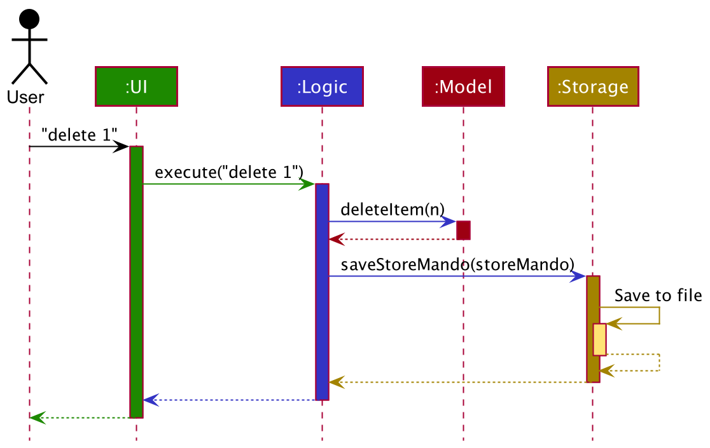

**The sections below give more details of each component.**

### UI component

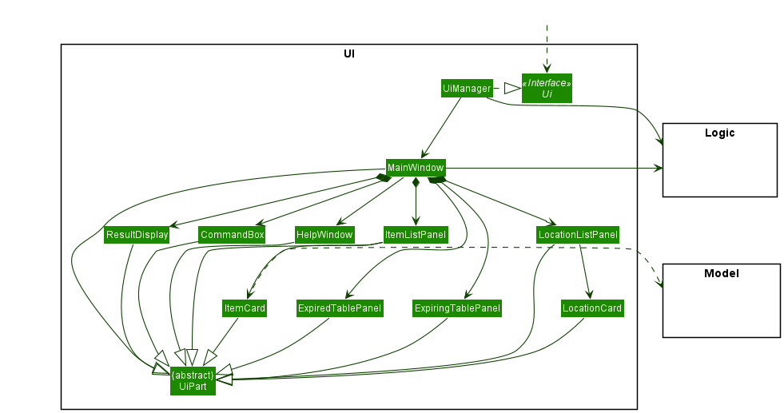

**API** :
[`Ui.java`](https://github.com/AY2021S2-CS2103T-W10-2/tp/blob/master/src/main/java/seedu/storemando/ui/Ui.java)

The UI consists of a `MainWindow` that is made up of parts `CommandBox`, `ResultDisplay`, `ItemListPanel`
, `LocationListPanel` and `ReminderPanel`. All these, including the `MainWindow`, inherit from the abstract `UiPart` class.

The `UI` component uses JavaFx UI framework. The layout of these UI parts are defined in matching `.fxml` files that are
in the `src/main/resources/view` folder. For example, the layout of
the [`MainWindow`](https://github.com/AY2021S2-CS2103T-W10-2/tp/blob/master/src/main/java/seedu/storemando/ui/MainWindow.java)
is specified
in [`MainWindow.fxml`](https://github.com/AY2021S2-CS2103T-W10-2/tp/blob/master/src/main/resources/view/MainWindow.fxml)

The `UI` component,

* Executes user commands using the `Logic` component.
* Listens for changes to `Model` data so that the UI can be updated with the modified data.

### Logic component

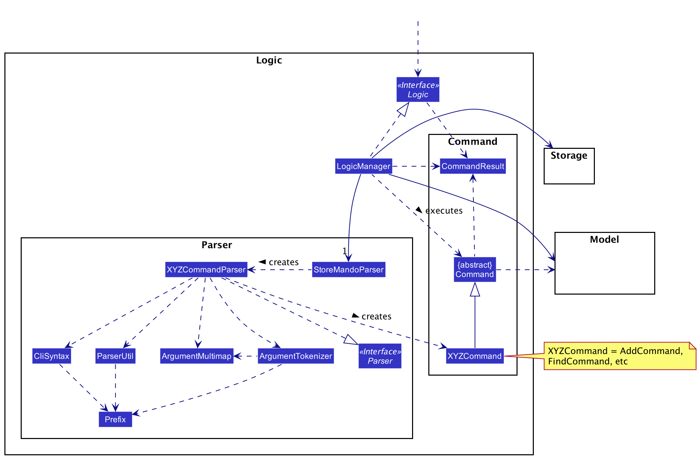

**API** :
[`Logic.java`](https://github.com/AY2021S2-CS2103T-W10-2/tp/blob/master/src/main/java/seedu/storemando/logic/Logic.java)

1. `Logic` uses the `StoreMandoParser` class to parse the user command.
1. This results in a `Command` object which is executed by the `LogicManager`.
1. The command execution can affect the `Model` (e.g. adding an item).
1. The result of the command execution is encapsulated as a `CommandResult` object which is passed back to the `Ui`.
1. In addition, the `CommandResult` object can also instruct the `Ui` to perform certain actions, such as displaying
   help to the user.
   
Given below is the Sequence Diagram for interactions within the `Logic` component for the `execute("delete 5")` API
calls respectively.

:information_source: **Note:** The lifeline for `DeleteCommandParser` should end at the destroy marker (X) but due to a 
limitation of PlantUML, the lifeline reaches the end of diagram.

### Model component

**API** :
[`Model.java`](https://github.com/AY2021S2-CS2103T-W10-2/tp/blob/master/src/main/java/seedu/storemando/model/Model.java)

The `Model`,

* stores a `UserPref` object that represents the user’s preferences.
* stores the StoreMando data.
* exposes an unmodifiable `ObservableList<Item>` that can be 'observed' e.g. the UI can be bound to this list so that
  the UI automatically updates when the data in the list change.
* does not depend on any of the other three components.

### Storage component

**API** :
[`Storage.java`](https://github.com/AY2021S2-CS2103T-W10-2/tp/blob/master/src/main/java/seedu/storemando/storage/Storage.java)

The `Storage` component,

* can save `UserPref` objects in json format and read it back.
* can save the StoreMando data in json format and read it back.

### Common classes

Classes used by multiple components are in the `seedu.storemando.commons` package.

--------------------------------------------------------------------------------------------------------------------

## **Implementation**

### Add Feature `add`

The add feature allows users to add an item's details to the inventory. An item's details is made up of a name,
quantity, location, expiry date, and tags.

:information_source: **Note:** 
An item's name, quantity and location are compulsory fields that must be supplied by the user. Expiry date and tags are optional.

#### Actual Implementation

The sequence diagram below shows how the components interact with each other for the scenario where the user
issues the command `add n/apple q/2 l/kitchen`:

 

From the diagram above:

1. When the user keys in an input, `execute` method of `LogicManager` is called with the user input as the parameter.
2. In the method, `LogicManager` calls on the `parseCommand` method of `StoreMandoParser` to parse the user input.
3. The `StoreMandoParser` parses the user input, identifies it as an `AddCommand` and instantiates an `AddCommandParser` object. 
4. `StoreMandoParser` then invokes the `parse` method of the `AddCommandParser` object to further parse the arguments provided. In the `parse` method,
   the `AddCommandParser` ensures that the input is of the correct format and identifies the input for the item name, quantity, 
   location, expiry date and tag(s).
5. If all the inputs are valid, the `AddCommandParser` creates a new `Item` object, 
   and instantiates a new `AddCommand` object that contains the `Item` object. This `AddCommand` object will be
   returned to `LogicManager` via `StoreMandoParser`.
6. The `LogicManager` will then invoke the overridden `execute` method of the `AddCommand` object with `Model` as argument.   
7. Subsequently, the `AddCommand` object will add the `Item` object to `Model`, and return a `CommandResult` object to `LogicManager`.
8. This `CommandResult` will be returned at the end by `LogicManager`.

The following activity diagram summarizes what happens when a user executes the `add` command:

 

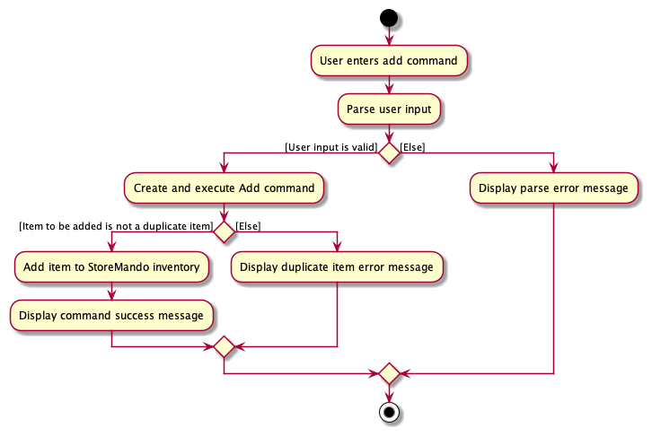

##### Proposed Improvements
1. Items with the same name, location and expiry date cannot co-exist in the inventory. Thus, every item that 
   is to be added has to be checked and validated that it is not a duplicate item. The current implementation to do so
   involves iterating through the list of all items to check if there already exists an item in the inventory that has 
   exactly the same name, location and expiry date. This process is slow and runs in O(n) time. It can be improved by 
   implementing a `HashMap` containing all the items currently stored in the inventory. This will allow the search to be 
   done in O(1) time. This feature was not implemented as it would introduce unnecessary complexity, and the current 
   solution meets the non-functional requirements regarding performance.

##### Design Considerations:

##### Aspect: Identifying the addition of duplicate item
* **Alternative 1 (current choice):** Compare item to be added and existing items in the inventory by **name, location 
  and expiry date**.
    * **Pros**: Allows users to store the same products that may have been produced in different batches. This would also 
      help users identify and differentiate similar products by their expiry date.
    * **Cons**: Items with the same name and location may be a potential source of confusion.

* **Alternative 2:** Compare item to be added and existing items in the inventory by **name and location** only.
    * **Pros**: Allows users to clearly distinguish items with the same names by location. This would prevent confusion and
      save users from going through the hassle of distinguishing items by expiry date.
    * **Cons**: Users would not be able to store similar items that have different expiry dates as a result of being 
      produced in different batches.

### Edit Feature `edit`
The edit feature allows users to edit an item's name, quantity, location, expiry date and tag.

The edit command has the following format: `edit INDEX [n/ITEM NAME] [l/LOCATION] [q/QUANTITY] [e/EXPIRY_DATE] [t/TAG]...`
and only changes the specified attribute.

:information_source: **Note:**
Even though the edit command expects the user input to only have multiple tag prefixes, it still allows
  other prefixes to be declared more than once. However, StoreMando only parses the last common prefix input to update the
  item.

#### Actual Implementation

The sequence diagram below shows how the components interact with each other for the scenario where the user
issues the command `edit 1 n/apple`: 

 

From the diagram above:

1. When the user keys in an input, `execute` method of the `LogicManager` is called with the given user input as parameter.

2. In the method, `LogicManager` calls on the `parseCommand` method of `StoreMandoParser` to parse the user input.

3. The `StoreMandoParser` parses the user input and identifies it as an `EditCommand` and instantiates an `EditCommandParser` object.

4. `StoreMandoParser` then invokes the `parse` method of `EditCommandParser` to further parse the arguments provided. In the `parse` method,
   the `EditCommandParser` ensures that the input is of the correct format and creates an `EditItemDescriptor` object 
   through `EditCommand`.

5. Based on the user input, the `EditItemDescriptor` updates its own attributes.

6. `EditCommandParser` creates an `EditCommand` object with the item index and `EditItemDescriptor`.

7. The `EditCommand` object is passed back to `StoreMandoParser` and then back to `LogicManager`.

8. The `LogicManager` then invokes the `execute` method of the `EditCommand` object with `Model` as argument.

9. `EditCommand` calls the `getFilteredItemList` method of `Model` to get the list of items. It also calls the
`createEditedItem` method to create the edited item. 

10. Using the index attribute of the `EditCommand` object, the targeted item from the list of items is retrieved and set to the
edited item.

11. `EditCommand` will create a `CommandResult` object and return it  to `LogicManager`.

12. This `CommandResult` will be returned in the end by `LogicManager`.

The following activity diagram summarizes what happens when a user executes the `edit` command:

 

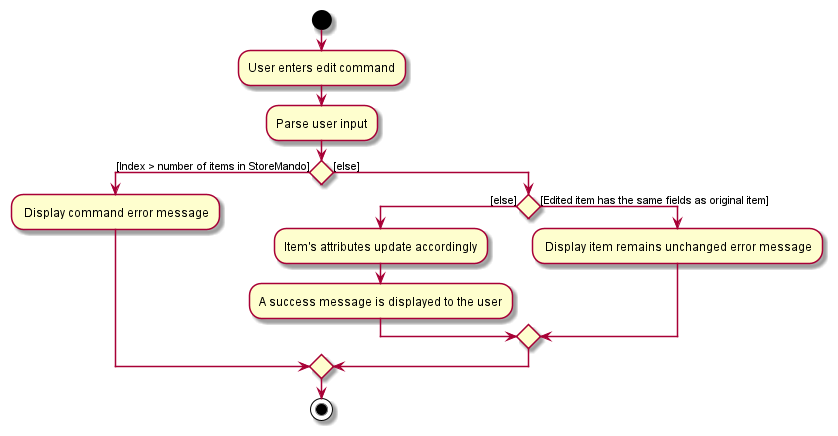

#### Design consideration:

##### Aspect: How `edit` executes

* **Alternative 1 (current choice):** Does not allow the edited item to have the same field as the original item.
    * **Pros**: User will be notified if original items are not being edited.
    * **Cons**: Harder to implement

* **Alternative 2:** Allows edited item to have the same fields as the original item.
    * **Pros**: Easy to implement.
    * **Cons**: May seem confusing that an edit with no changes result in a success.
    
### Delete Feature `delete`

The delete feature allows users to delete an item from the inventory by using the item's index in the displayed list.

#### Actual Implementation

The sequence diagram below shows how the components interact with each other for the scenario where the user
issues the command `delete 5` to delete the item with index 5 in the currently displayed list:

 

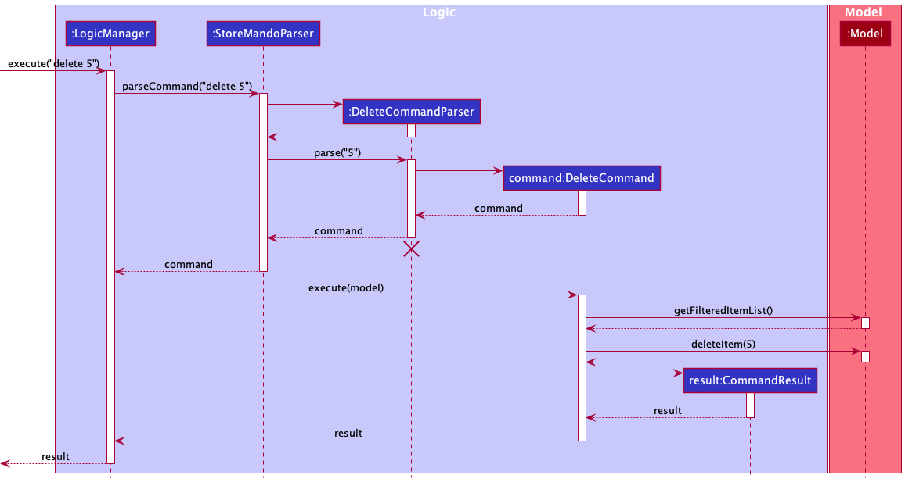

From the diagram above:

1. When the user keys in an input, `execute` method of `LogicManager` is called with the user input as the parameter.
2. In the method, `LogicManager` calls on the `parseCommand` method of `StoreMandoParser` to parse the user input.
3. The `StoreMandoParser` parses the user input, identifies it as a `DeleteCommand` and instantiates a `DeleteCommandParser` object.
4. `StoreMandoParser` then invokes the `parse` method of the `DeleteCommandParser` object to further parse the arguments provided. In the `parse` method,
   the `DeleteCommandParser` ensures that the input is of the correct format and identifies the input for the index of the item to be deleted.
5. If the index specified by the user is valid, a new `DeleteCommand` instance will be
   created and returned to `LogicManager` via `StoreMandoParser`.
6. The `LogicManager` will then invoke the overridden `execute` method of the `DeleteCommand` object with `Model` as the argument.
7. Subsequently, the `DeleteCommand` object will invoke `deleteItem` method of `Model` with the index of the item to delete as the argument. It will then return 
a `CommandResult` object to `LogicManager`.
8. This `CommandResult` will be returned at the end by `LogicManager`.

The following activity diagram summarizes what happens when a user executes the `delete` command:

 

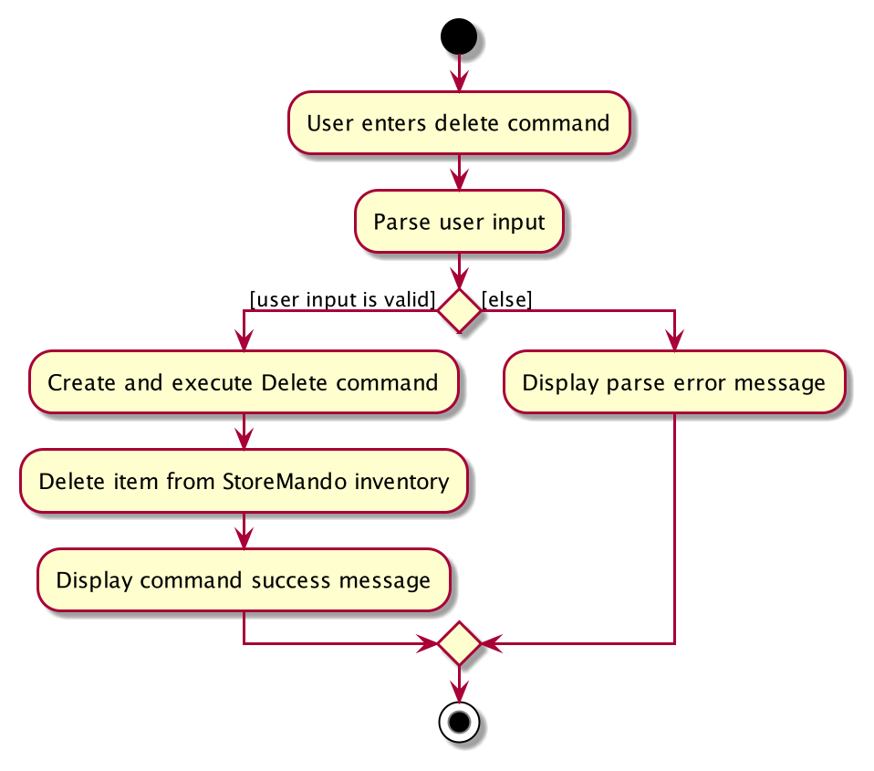

##### Aspect: How `delete` executes

* **Alternative 1 (current choice):** Delete item by its index in the displayed list.
    * **Pros**: Easy to implement.
    * **Cons**: Requires user to scroll through the list to find the item and specify the index.

* **Alternative 2:** Delete item by item name.
    * **Pros**: Will be easier for the user especially when there are many items in the list.
    * **Cons**: Items with the same name in different locations may cause confusion.

### Find Feature `find`

The `find` feature is helps users find and display all items whose names
contain any of the given keywords, either in full or partial.

`find KEYWORD [MORE_KEYWORDS]` displays items whose names contain any of the given keywords in full.

`find */KEYWORD [MORE_KEYWORDS]` display all items whose names contain any of the given partial keywords .

#### Actual Implementation

The sequence diagram below shows how the components interact with each other for the scenario where the user
keys in the command `find */cheese egg`:

 

 

The sequence diagram below shows how the components interact with each other for the scenario where the user
keys in the command `find Chocolate`:

 

From the diagram above:

1. When the user keys in an input, `execute` method of `LogicManager` is called with the given user input as parameter.
2. In the method, `LogicManager` calls on the `parseCommand` method of `StoreMandoParser` to parse the user input.
3. The `StoreMandoParser` parses the user input and identifies it as an `FindCommand` and instantiates a `FindCommandParser` object.
4. `StoreMandoParser` then invokes the `parse` method of `FindCommandParser` to further parse the arguments provided. In the `parse` method,
   the `FindCommandParser` ensures that there are keywords provided.
5. If there are any keywords present, a `FindCommand` object will be
   created and returned to the `StoreMandoParser` which will then return it to the `LogicManager`.
6. The `LogicManager` will then invoke the `execute` method of the `FindCommand` object with `model` as argument.
7. In the `execute` method, `FindCommand` calls the `updateCurrentPredicate` method of `Model` and passes its own predicate attribute as argument.
8. `FindCommand` calls the `getCurrentPredicate` method of `Model` to obtain the current predicate and uses it
   to update the list by calling on `updateFilteredItemList` method of `Model` with the current predicate as argument.
9. Finally, a `CommandResult` object is created and returned to `LogicManager`.
10. This `CommandResult` object will be returned in the end by `LogicManager`.

The following activity diagram summarizes what happens when a user executes the `find` command:

 

#### Design consideration:

##### Aspect: How `find` executes

* **Alternative 1 (current choice):** Find items in the current list that matches the keyword, either fully or partially.
    * **Pros**: Easy to implement.
    * **Cons**: The search is limited to matching names. If there are many items containing that keyword, the search may not be efficient.

* **Alternative 2:** Find items in the current list that matches the keyword, and an attribute e.g. tag.
    * **Pros**: Users would be able to retrieve a specific item more efficiently.
    * **Cons**: Users need to remember the items' attributes.
    

### List Feature `list`

The `list` feature allows users to list all items in the inventory based on the order they were added.

The `list l/LOCATION` and `list t/TAG` features allow users to list all items in a specific location
or with a specific tag respectively.

#### Actual Implementation

The sequence diagram below shows how the components interact with each other for the scenario where the user
keys in the command `list`:

 

From the diagram above:

1. When the user keys in an input, `execute` method of `LogicManager` is called with the user input as the parameter.
2. In the method, `LogicManager` calls on the `parseCommand` method of `StoreMandoParser` to parse the user input.
3. The `StoreMandoParser` parses the user input, identifies it as a `ListCommand` and instantiates a `ListCommandParser` object.
4. `StoreMandoParser` then invokes the `parse` method of the `ListCommandParser` object to further parse the arguments provided. In the `parse` method,
   the `ListCommandParser` ensures that the input is of the correct format.
5. If the user input is valid, a new `ListCommand` instance will be created and returned to `LogicManager` via `StoreMandoParser`.
6. The `LogicManager` will then invoke the overridden `execute` method of the `ListCommand` object with `Model` as argument.
7. In the `execute` method, `ListCommand` calls the `updateCurrentPredicate` method of `Model` and then calls the `getCurrentPredicate` method of 
   `Model` to retrieve the current predicate. The retrieved predicate is then used to update the list by calling on `updateFilteredItemList` method of `Model`.  
8. Subsequently, a `CommandResult` object is created and returned to `LogicManager`.
9. This `CommandResult` will be returned at the end by `LogicManager`.

The following activity diagram summarizes what happens when a user executes the `list` command:

 

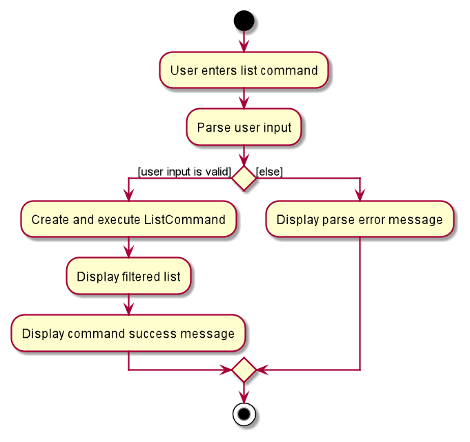

#### Design consideration:

##### Aspect: How `list` executes

* **Alternative 1 (current choice):** List the entire inventory in the order they were added.
    * **Pros**: Easy to implement.
    * **Cons**: Items in the same location may not be displayed together and may appear disorganised.

* **Alternative 2:** List the entire inventory categorised in their specific locations.
    * **Pros**: More organised overview of all the items in the inventory.
    * **Cons**: Difficult to implement.
    

### Reminder Feature `reminder`

The reminder feature allows users to view items that are expiring within a certain number of days/weeks as specified by the user.

#### Actual Implementation

The sequence diagram below shows how the components interact with each other for the scenario where the user
issues the command `reminder 1 week`:

 

 

The sequence diagram below shows how the components interact with each other for the scenario where the user
issues the command `reminder 3 days`:

 

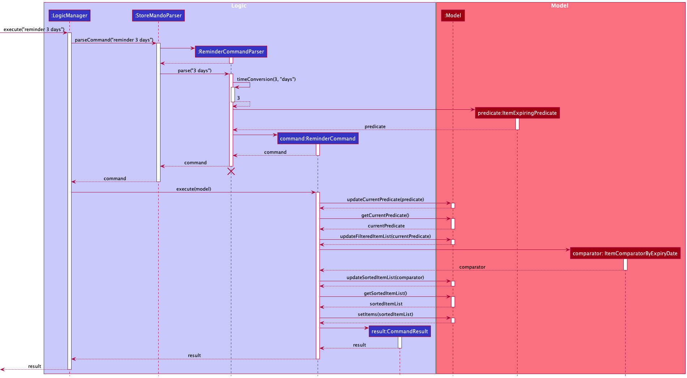

From the diagrams above:

1. When the user keys in an input, `execute` method of `LogicManager` is called with the user input as the parameter.
2. In the method, `LogicManager` calls on the `parseCommand` method of `StoreMandoParser` to parse the user input.
3. `StoreMandoParser` parses the user input and determines that the command given is a `ReminderCommand`.
   Then, a `ReminderCommandParser` object is created to further parse the command.
4. `StoreMandoParser` then calls on the `parse` method of `ReminderCommandParser` to parse the arguments provided.
5. `ReminderCommandParser` calls on its own `timeConversion` method to convert the user input string into an integer.
6. `ReminderCommandParser` then calls on the constructor of `ItemExpiringPredicate` with the integer as parameter to
   create an `ItemExpiringPredicate` object and then instantiates a `ReminderCommand` object with the `ItemExpiringPredicate` object as
   a parameter.
7. The `ReminderCommand` will be returned to `StoreMandoParser` which returns it to `LogicManager`.
8. `LogicManager` then calls on the overridden `execute` method of `ReminderCommand` with `Model` as argument.
9. `ReminderCommand` calls the `updateCurrentPredicate` method of `Model` and passes its own `ItemExpiringPredicate`
   as argument.
10. `ReminderCommand` calls the `getCurrentPredicate` method of `Model` to obtain the current predicate and uses it
    to update the list by calling on `updateFilteredItemList` method of `Model` with the current predicate as argument.
11. `ReminderCommand` then creates a `ItemComparatorByExpiryDate` object and calls `Model`'s `updateSortedItemList` with
    `ItemComparatorByExpiryDate` as argument to sort the list.
12. Finally, a `CommandResult` object is created and returned to `LogicManager`.
13. This `CommandResult` object will be returned at the end by `LogicManager`.

The following activity diagram summarizes what happens when a user executes a `reminder` command:

 

#### Design consideration:

##### Aspect: How `reminder` executes

* **Alternative 1 (current choice)** : Provide an integer as an input argument
    * **Pros**: Faster to type as compared to date in a particular format.
    * **Cons**: More cases to consider when parsing the command.

* **Alternative 2** : Provide a date in the format of YYYY-MM-DD as input
    * **Pros**: Easier to compare between items as the input date can be used to create an `expiryDate` object
    which can be used to compare with all the items' expiry dates.
    * **Cons**: When the user wants to find items that are already expired, it is easier to key in a number then to
    find a particular date and key it in. This is more taxing on the user.

### Sort Feature `sort`

The `sort` feature allows users to view the items in the displayed list of items in a specific order.

The `sort quantity asc` and` sort quantity desc` commands allows users to view all items in the displayed list in
ascending or descending order of quantity respectively. 

In comparison, the `sort expirydate` command allows users to
view items in the displayed list in chronological order of their expiry date.

#### Actual Implementation

The sequence diagram below shows how the components interact with each other for the scenario where the user
keys in the command `sort quantity asc`:

 

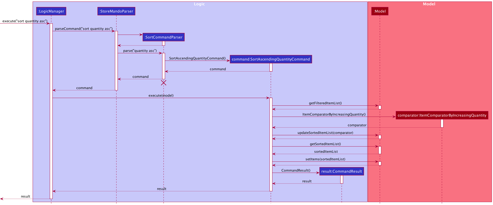

From the diagram above:
1. When the user keys in an input, `execute` method of `LogicManager` is called with the user input as the parameter.
2. In the method, `LogicManager` calls on the `parseCommand` method of `StoreMandoParser` to parse the user input.
3.  The `StoreMandoParser` parses the user input, identifies it as a `SortCommand` and instantiates a `SortCommandParser` object.
4. `StoreMando` then invokes the method `parse` of `SortCommandParser` to further parse the user input.
   The `SortCommandParser` ensures that the input is of the correct format and identifies the type of 
   sorting to be done.
5. If the input is valid, the `SortCommandParser` creates a new 
   `SortAscendingQuantityCommand` object. This `SortAscendingQuantityCommand` object will be returned to the 
   `StoreMandoParser` which will return it to the `LogicManager`.
6. The `LogicManager` will then invoke the `execute` method of the `SortAscendingQuantityCommand` object.
7. The `SortAscendingQuantityCommand` object will then retrieve the currently displayed list of items through the 
   `getFilteredItemList` method of `Model` to check if there are items to be sorted.
8. If there are items to be sorted, `SortAscendingQuantityCommand` will create an `ItemComparatorByIncreasingQuantity` 
   comparator object that determines how any two items in the list should be compared.
9. `SortAscendingQuantityCommand` calls on `Model`'s `updateSortedItemList` method with the comparator as parameter to sort the list of items. 
10. `SortAscendingQuantityCommand` will then call `setItems` method of `Model` and pass in the sorted list of items 
    retrieved from `Model` through it's `getSortedItemList` method. This would result in the sorted list of items
    being displayed.
    
11. Upon completion, `SortAscendingQuantityCommand` creates a `CommandResult` object and passes it back to `LogicManager`.
    
12. This `CommandResult` will be returned at the end by `LogicManager`.

The following activity diagram summarizes what happens when a user executes a `sort quantity asc` command:

 

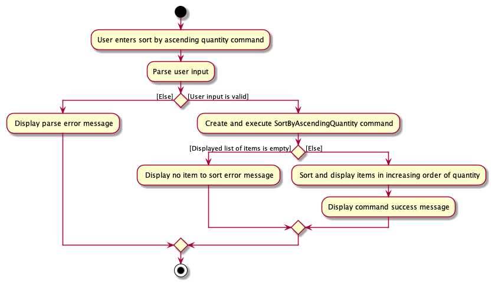

##### Design Considerations:

##### Aspect: Data structure to  use to sort the list of items

* **Alternative 1 (current choice):** Maintain current implementation of filtered list and utilise a new sorted list to sort items.
    * **Pros**: Faster alternative and easy to implement as existing components need not be modified.
    * **Cons**: Have to ensure the toggling between sorted list and filtered list is done accurately for each command.
    

* **Alternative 2:** Change underlying list implementation from filtered list to a list that supports sorting.
    * **Pros**: Easy to maintain once implemented.
    * **Cons**: Changing of underlying list implementation introduces unnecessary complexity and delay as all the other components
      that depend on filtered list implementation would have to be changed as well.

### Clear Feature `clear`

The clear feature allows users to either clear all items in the inventory or clear all items from a specific location.

#### Actual Implementation 

The sequence diagram below shows how the components interact with each other for the scenario where the user
keys in the command `clear`:

 

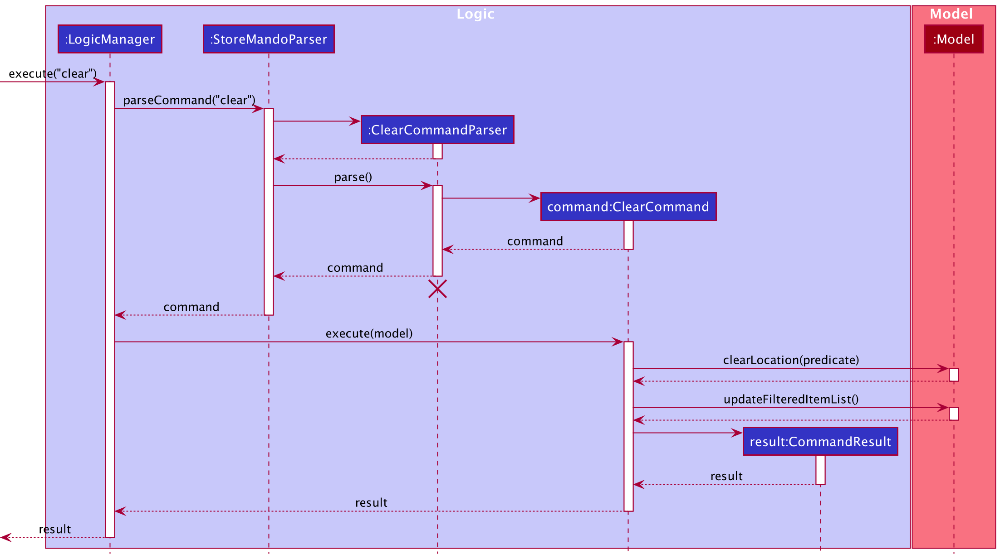

 

The sequence diagram below shows how the components interact with each other for the scenario where the user
keys in the command `clear l/Kitchen`:

 

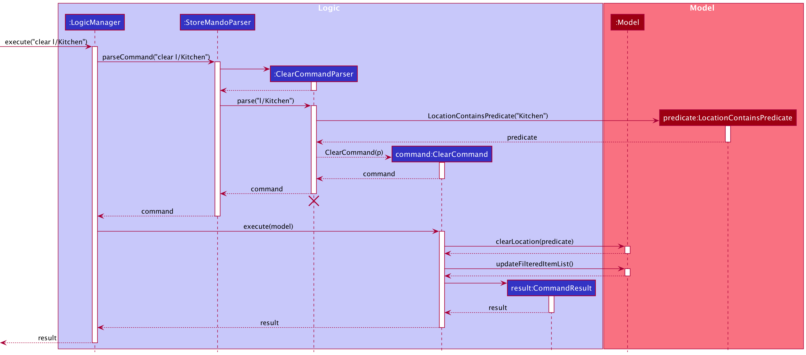

From the diagram above:

1. When the user keys in an input, `execute` method of the `LogicManager` is called with the user input as parameter.
2. In the method, `LogicManager` calls on the `parseCommand` method of `StoreMandoParser` to parse the user input.
3. `StoreMandoParser` parses the user input, identifies it as a `ClearCommand` and instantiates a `ClearCommandParser` object.
4. `StoreMandoParser` then calls on the `parse` method of `ClearCommandParser` to parse the arguments provided.
5. `ClearCommandParser` checks if there are any arguments provided. If there are not, the constructor of `ClearCommand`
    without any parameters is called. Else, a `LocationContainsPredicate` object will be created with the arguments
    as parameter. This `LocationContainsPredicate` will be passed as a parameter to create a `ClearCommand` object.
6. `ClearCommand` object will be returned to `ClearCommandParser` which then returns it to `LogicManager`.
7. `LogicManager` then calls the `execute` method of `ClearCommand` with a `Model` as argument.
8. `ClearCommand` calls on the `clearLocation` method of `Model` with the `ClearCommand`'s predicate attribute as parameter.
    Subsequently, it calls on `Model`'s `updateFilteredItemList` method.
9. Finally, a `CommandResult` object is created and is returned to `LogicManager`.
10. The `CommandResult` object will be returned in the end by `LogicManager`.

The following activity diagram summarizes what happens when a user executes the clear by location command:

 

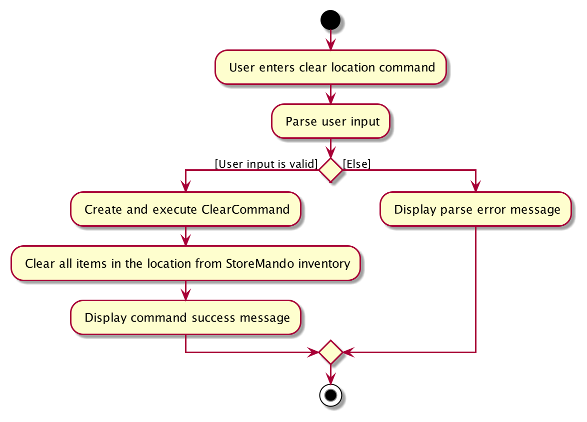

### Help Feature `help`

The help feature redirects users to StoreMando's User Guide. If the device is connected to the Internet, StoreMando 
will automatically open the User Guide in a new browser. Otherwise, it will have a pop out window with the User
Guide link.

The help command has the following format :`help`.

:information_source: **Note:**
Even though the help command expects the user input to contain the `help` command keyword, it still allows users to
  append arguments. However, the arguments will not be parsed by StoreMando.

#### Actual Implementation

The sequence diagram below shows how the components interact with each other for the scenario where the user
keys in the command `help`:

 

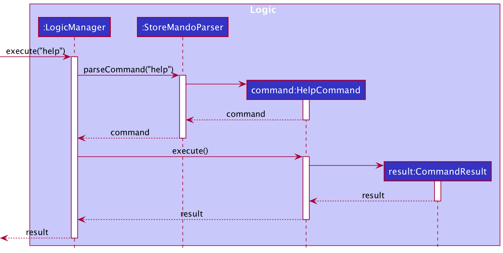

From the diagram above:

1. When the user keys in an input, `execute` method of the `LogicManager` is called with the user input as parameter.
2. In the method, `LogicManager` calls on the `parseCommand` method of `StoreMandoParser` to parse the user input.
4. The input string is separated into command keyword and arguments containing the prefixes with the updated item's
    attribute.
5. StoreMandoParser recognises that it is a `HelpCommand` and creates a `HelpCommand` object.
6. The `HelpCommand` is passed back to `LogicManager`.
7. `LogicManager` then calls the `execute` method of `HelpCommand` with `Model` as argument.
8. A new tab of the user guide will be opened if there is Internet connection. Otherwise, the URL link of the user guide
   will be provided. `HelpCommand` will then create a `CommandResult` and pass to `LogicManager`.
9. The `CommandResult` object will be returned in the end by `LogicManager`.   

The following activity diagram summarizes what happens when a user executes a help command:

 

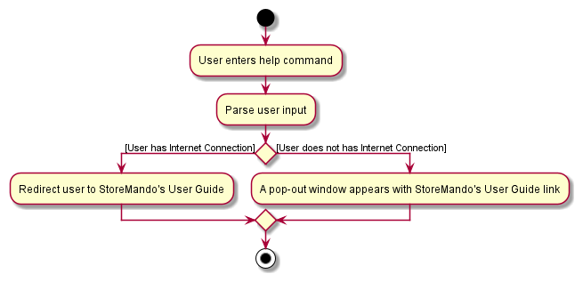

#### Design Considerations

##### Aspect: How `help` executes

* **Alternative 1 (Current choice):** Automatically open a browser to StoreMando's User Guide when there is internet access.
    * **Pros**: User don't have to manually copy and paste the link on their browser.

* **Alternative 2**: Provide user the link to StoreMando's user guide.
    * **Pros**: Easier to implement.
    * **Cons**: User has to copy and paste their link manually on their browser to get to the User guide.
    
--------------------------------------------------------------------------------------------------------------------

## **Documentation, logging, testing, configuration, dev-ops**

* [Documentation guide](Documentation.md)
* [Logging guide](Logging.md)
* [Testing guide](Testing.md)
* [Configuration guide](Configuration.md)
* [DevOps guide](DevOps.md)

--------------------------------------------------------------------------------------------------------------------

## **Appendix: Requirements**

### Product scope

**Target user profile**:

* household resident
* has a lot of items at home and cannot constantly keep track of their respective locations
* has a lot of perishable items with various expiry dates that are difficult to remember
* prefers desktop applications over other types
* fast typist
* prefers typing to using mouse
* comfortable using CLI applications

**Value proposition**: Every info of every item you have at home - all in one place. One command is all you have to key
in to add, delete or find for an item. StoreMando keeps track of everything you need so that you don't have to
physically search for an item to obtain information on it. Get everything you need from StoreMando - locations,
quantities and expiry dates.

### User stories

Priorities: High (must have) - `* * *`, Medium (nice to have) - `* *`, Low (unlikely to have) - `*`

| Priority | As a …​ | I want to …​ | So that I can…​ | 
| -------- | ---------- | --------------- | ------------------ | 
| `* * *` | user | add an item to the inventory | keep track of it’s location, quantity and expiry date |
| `* * *` | user who discards items often | delete an item from the inventory | remove it when it is expired or used up |
| `* * *` | user who stocks up items regularly | update my items’ details | change the items' expiry dates and/or quantities accordingly | 
| `* * *` | user with many items | list down all my items | know all the items I have in one glance |
| `* * *` | forgetful user with many items | find an item quickly using its name | locate them easily |
| `* *` | user who has many items in the storeroom | view all items in the storeroom | keep track of exactly what I have | 
| `* *` | user who keeps track of my guests' favourites | view all items tagged with "guests" | better prepare the items when hosting my guests |
| `* *` | grocery buyer of the household | sort my items in terms of increasing quantity | stock up items that are running low on quantity |
| `* *` | user who does not like wastage | sort my items in terms of decreasing quantity | use up items that are high in quantity first |
| `* *` | user who does not like to waste food | sort my food items in terms of expiry date | consume food that is expiring first |
| `* *` | user who does not like to waste food | be reminded of all food items expiring in a specified number of days | consume them within that period |
| `*` | user who discards large number of items at once | clear all the items in the inventory | start the list afresh without having waste time deleting each item manually |
| `*` | user who does room cleaning during spring cleaning | clear all the items in a certain location | add them back to different places easily |

### Use cases

(For all use cases below, the **System** is the `StoreMando` and the **Actor** is the `user`, unless specified
otherwise)

**Use case: UC1 - Add an item**

**MSS**

1. User requests to add a specific item into the inventory list.
2. StoreMando adds the item into the inventory list and displays the updated list of items.

   Use case ends.

**Extensions**

* 1a. User input has invalid syntax.

    * 1a1. StoreMando shows an error message.

      Use case resumes at step 1.

* 1b. Duplicate item exists in the inventory.

    * 1b1. StoreMando shows an error message.

      Use case resumes at step 1.
    
* 1c. User inputs a number smaller than 0 or larger than 1,000,000.

    * 1c1. StoreMando shows an error message.

      Use case resumes at step 1.

**Use case: UC2 - Delete an item in a specific location**

**MSS**

1. User requests to <u> list all items in a specific location (UC7). </u>
2. StoreMando displays all items in the location.
3. User requests to delete a specific item in the list.
4. StoreMando deletes the specified item from the list and displays the updated list of items.

   Use case ends.

**Extensions**

* 2a. There are no items in the specified location.

  Use case ends.

* 3a. The index keyed in by the user does not exist in the displayed list.

    * 3a1. StoreMando shows an error message.

      Use case resumes at step 3.

**Use case: UC3 - Find an item**

**MSS**

1. User requests to find an item with a particular name.
2. StoreMando returns a list of all items whose name contains the name specified by the user.

   Use case ends.

**Use case: UC4 - Edit an item**

**MSS**

1. User requests to edit an existing item's details.
2. StoreMando edits the specified item and displays the updated list of items.

   Use case ends.

**Extensions**

* 1a. The command keyed in by the user has an invalid syntax.

    * 1a1. StoreMando shows an error message.

      Use case resumes at step 1.

* 1b. The new details keyed in by the user is the same as the existing details of the item.

    * 1b1. StoreMando shows an error message.

      Use case resumes at step 1.

* 1c. User inputs a number smaller than 0 or larger than 1,000,000.

    * 1c1. StoreMando shows an error message.

      Use case resumes at step 1.
    
**Use case: UC5 - Check for expiring items**

**MSS**

1. User wants to search for items that are expiring within a specific number of days.
2. StoreMando displays a list of items that have either expired or are expiring within the specified number of days.

   Use case ends.

**Extensions**

* 1a. User inputs a number smaller than -365 or larger than 365.

    * 1a1. StoreMando shows an error message.

      Use case resumes at step 1.

* 1a. Time unit input is neither day(s) or week(s)

    * 1a1. StoreMando shows an error message.

      Use case resumes at step 1.

**Use case: UC6 - List all items**

**MSS**

1. User requests to display all items in the inventory.
2. StoreMando displays all items in the inventory.

   Use case ends.

**Use case: UC7 - List all items in a specific location**

**MSS**

1. User requests to display all items in a specific location.
2. StoreMando displays all items in that specific location.

   Use case ends.

**Extensions**

* 1a. User input has invalid syntax.

    * 1a1. StoreMando shows an error message.

      Use case resumes at step 1.

**Use case: UC8 - List all items with a specific tag**

**MSS**

1. User requests to display all items with a specific tag.
2. StoreMando displays all items with the specific tag.

   Use case ends.

**Use case: UC9 - Sort items in ascending order of quantity**

**MSS**

1. User requests to sort the items in the displayed list in increasing order of quantity.
2. StoreMando displays the list of items in increasing order of quantity.

   Use case ends.

**Use case: UC10 - Sort items in descending order of quantity**

**MSS**

1. User requests to sort the items in the displayed list in decreasing order of quantity.
2. StoreMando displays the list of items in decreasing order of quantity.

   Use case ends.

**Use case: UC11 - Sort items by expiry date**

**MSS**

1. User requests to sort the items in the displayed list by expiry date.
2. StoreMando displays a sorted list of the items in chronological order of their expiry date.

   Use case ends.

**Use case: UC12 - Clear all items**

**MSS**

1. User requests to clear all items in the inventory.
2. StoreMando deletes all items in the inventory.

Use case ends.

**Use case: UC13 - Clear all items in a specific location**

**MSS**

1. User requests to delete all items in a specific location.
2. StoreMando deletes all items in that location.

Use case ends.

**Extensions**

* 1a. The location keyed in by the user does not exist in the inventory.

    * 1a1. StoreMando shows an error message.

      Use case resumes at step 1.

### Non-Functional Requirements

1. **Performance**
    * Result should appear within 0.3 seconds after user keys in a command.
2. **Reliability**
    * Should be able to hold up to 1000 line items in the house without any sluggish performance for typical usage.
    * Should be able to detect and inform users of duplicate items (i.e. same name, location and expiry date) and prevent users from adding them.
    * Should be able to detect and inform users of expired items when being added to the inventory.
3. **Portability**
    * Should work on any _mainstream OS_ as long as it has Java `11` or above installed.
4. **Usability**
    * A user with above average typing speed for regular English text (i.e. not code, not system admin commands) should
      be able to accomplish most of the tasks faster by typing rather than using the mouse.
    * A user should be able to use all functionalities of the application without needing to use a mouse to navigate.
    * StoreMando should work with or without Internet connection.
5. **Security**
    * Users that request to delete any item from the inventory will have that item permanently removed from memory.
    
### Glossary

* **Mainstream OS**: Windows, Linux, Unix, OS-X
* **StoreMando**: Name of the application
* **CLI**: Command Line Interface
* **GUI**: Graphical User Interface
* **User**: Any member under the same household
* **Inventory**: List of all items stored in StoreMando
* **Tag**: A miscellaneous piece of information that the user associates the item with, that isn't captured by the other fields but is good to have.

--------------------------------------------------------------------------------------------------------------------

## **Appendix: Instructions for manual testing**

Given below are instructions to test the app manually.

:information_source: **Note:** These instructions only provide a starting point for testers to work on;
testers are expected to do more *exploratory* testing.

### Launch and shutdown

1. Initial launch

    1. Download the jar file and copy into an empty folder

    1. Launch the jar file using the java -jar command rather than double-clicking (reason: to ensure the jar file is 
       using the same java version that you verified above). Use double-clicking as a last resort.
       If you are on Windows, use the DOS prompt, or the PowerShell (not the WSL terminal) to run the JAR file. The 
       window size may not be optimum.

1. Saving window preferences

    1. Resize the window to an optimum size. Move the window to a different location. Close the window.

    1. Re-launch the app using the jar file. 
       Expected: The most recent window size and location is retained.

### Adding an item

1. Adding an item to the inventory

    1. Prerequisites: Arguments are valid and compulsory parameters are provided. No duplicate item or similar item
       exists in the list.

    1. Test case: `add n/Apple l/table q/1` 
       Expected: Item is added into the displayed list. Details of the added item shown in the status message.

    1. Test case: `add n/Banana l/kitchen q/1 e/2020-10-10` 
       Expected: Similar to previous.

    1. Test case: `add ` 
       Expected: No item is added. Error details shown in the status message.

    1. Other incorrect add commands to try: `add n/`, `add l/kitchen`, `...` (where compulsory fields are not
       specified) 
       Expected: Similar to previous.

### Edit an item

1. Editing an item in the inventory 

    1. Prerequisites: There are items in the inventory.
    
    1. Test case: `edit 1 n/Apple` 
       Expected: The name of the first item is edited to `Apple`. Details of the edited item shown in the status message.
       
    1. Test case: `edit 0 n/Apple` 
       Expected: No item is edited. Error details shown in the status message.

### Deleting an item

1. Deleting an item from the inventory

    1. Prerequisites: List all household items using the `list` command. Multiple items in the list.

    1. Test case: `delete 1` 
       Expected: First item is deleted from the list. Details of the deleted item shown in the status message.

    1. Test case: `delete 0` 
       Expected: No item is deleted. Error details shown in the status message.

    1. Other incorrect delete commands to try: `delete`, `delete x`, `...` (where x is larger than the list size) 
       Expected: Similar to previous.

### Finding an item

1. Finding an item in the inventory

    1. Test case: `find banana` 
       Expected: All items containing `banana` as a word in the name are shown.

    1. Test case: `find */nana` 
       Expected: All items containing `nana` as part of a word in the name are shown.

### Listing items

1. Listing all the items in the inventory

    1. Test case: `list` 
       Expected: All items are being displayed.

1. Listing items in a specific location
   
    1. Test case: `list l/Bedroom` 
       Expected: All items with `Bedroom` as the location are being displayed.

1. Listing items with a specific tag 

    1. Test case: `list t/food` 
       Expected: All items with `food` as the tag are being displayed.

### Show items x days/weeks from expiry date

1. Showing items x days from expiry date

    1. Test case: `reminder 7 days` 
       Expected: All items that have already expired or are expiring within the next 7 days are shown.

1. Showing items x weeks from expiry date 

    1. Test case: `reminder 7 weeks` 
       Expected: All items that have already expired or are expiring within the next 7 weeks are shown.

### Sorting items

1. Sorting items in the inventory in terms of quantity.

    1. Test case: `sort quantity asc` 
       Expected: All the items are sorted in terms of quantity from least to most.

    1. Test case: `sort quantity desc` 
       Expected: All the items are sorted in terms of quantity from most to least.

    1. Incorrect sort commands to try: `sort`, `sort quantity` 
       Expected: Error details shown in the status message.

1. Sorting items in the inventory in terms of expiry date.

    1. Test case: `sort expirydate` 
       Expected: All the items are sorted in chronological order of their expiry date.

### Clearing items

1. Clearing all the items in the inventory

    1. Test case: `clear` 
       Expected: All items are cleared from the inventory.

1. Clearing all the items in a specific location 

    1. Test case: `clear l/Bedroom` 
       Expected: All items in the specified location are cleared.
